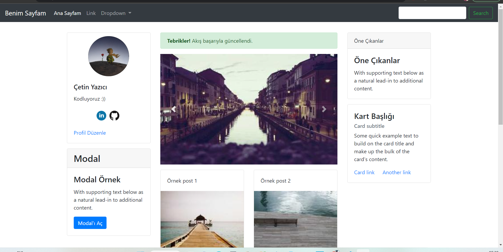
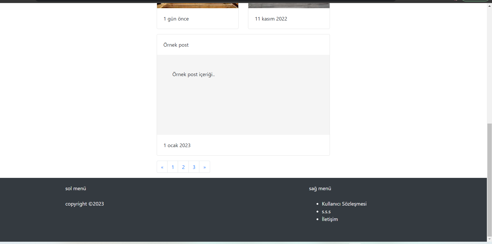

# Müzik Dükkanım
Bu repo [kodluyoruz](https://kodluyoruz.org/) Front-end eğitimde oluşturduğumuz Bootstrap Kullanarak Web Sitesi Nasıl Yapılır (Demo) adı altında oluşturulmuş onuncu repodur. İçerisinde bir adet README.md dosyası, bir adet de index.html, bir adet images dosyası, bir adet css dosyası barındırıyor.

## Proje Görünümü

## Hesaplarım 

Github [click](https://github.com/cetinyazici) !

LinkedIn [click](https://www.linkedin.com/in/cetinyazici/) !

Patika.dev [click](https://app.patika.dev/yazilimyazici) !